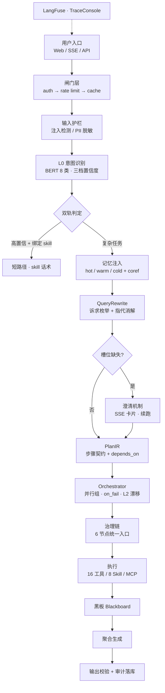

# NexusAI

    

> **企业级 AI 内容平台 + LLM 治理底座** —— 从热点发现到内容发布一条流水线，每一次模型调用都可控、可审计、可合规。

[简体中文](README.md) · [系统架构大图](docs/architecture.html)

---

## 1. 项目简介

**NexusAI（奈克斯引擎）**：面向企业（尤其小微企业与内容团队）的一站式 AI 内容运营平台，同时是**自研的企业级 LLM 治理中台**。

- **业务层**：热点雷达、文案工厂、风格模仿、内容管家、团队协作 —— 找热点、写文案、出分镜、剪视频，一个 AI 全包
- **技术层**：三层意图路由、Agent 编排、统一工具生态、统一治理链、全链路审计 —— 企业接入大模型的治理入口

**项目层级：全栈自研**（后端 FastAPI + 前端 React + 意图识别模型自训 + **基于 LangGraph 的自研编排层**：并行组 / on_fail 语义 / L2 漂移 / 黑板模式）。

**解决的痛点：** 企业接入 LLM 时的接入混乱、安全失控、合规缺失、成本黑洞、能力分散；以及内容团队"找热点靠盯、写文案靠憋、改风格靠磨合"的低效循环。

---

## 2. 核心亮点

| 亮点 | 说明 |
|------|------|
| 🧭 **自研意图识别模型 V1.0** | 8 类业务意图（BERT 微调，独立训练集 F1 0.99 / 冻结集 98.8%，详见下方模型评估） |
| 🛡️ **统一治理链** | 所有工具/模型调用统一经治理链：policy → budget → approval → IAM → audit → release（审批真接线规划中），**无旁路入口** |
| 🔧 **统一工具生态** | ToolRegistry：16 契约化工具 + 8 Skill + 标准 MCP 客户端，三类来源同一注册表同一治理链（数量以代码为准，自动发现） |
| ⚡ **毫秒级响应，几乎零成本** | 双路径路由：高置信意图走 skill 短路径（零 LLM 调用）；自训 110M 小模型 CPU 毫秒级分类 |
| 🧠 **分层记忆 + 混合检索** | hot/warm/cold 三层记忆 + 结构化摘要 + 跨轮指代消解（coref 表）+ BM25/向量 RRF 混合召回 |
| 📊 **可审计可溯源可追责** | 全链路审计血缘 + 加密落库 + LangFuse span + TraceConsole 执行轨迹回放 |
| 🔐 **BYOK + 私有化** | 密钥 AES-256-GCM 加密托管、池化/BYOK 分档并发、私有化部署数据不出域 |

---

## 3. 系统架构



---

## 4. 核心能力列表

### 业务能力（内容运营闭环）

| 能力 | 说明 |
|------|------|
| 🔥 热点雷达 | 今日热点自动抓取，行业适配创作思路 |
| ✍️ 文案工厂 | 口播稿 / 公众号软文 / 社媒文案，多版本快速生成 |
| 🎭 风格模仿 | 学习企业文案风格，品牌表达统一（口头禅/语气/风格复刻） |
| 📅 内容管家 | 内容排期、定时任务、自动执行创作计划 |
| 👥 团队协作 | 站内协作与审批流；飞书/企微渠道对接**规划中**（webhook 骨架已就位） |
| 🛡️ 行业红线 | 教育等行业合规自动避让：不承诺提分、不碰隐私、竞品话术拦截 |

### 平台能力（工具与 Skill 生态）

**13 个内置工具**（契约化 + 风险分级）：`rag.search` · `web.search` · `memory.search/write` · `im.notify` · `calendar.query/create` · `mail.draft/send` · `docx.generate` · `sql.query`（只读+白名单+脱敏） · `analytics.summary` · `code.exec`（沙箱） · `deploy.release` · `sys.metrics` · `plan.status`

**8 个内置 Skill**（话术引擎，发布三关）：客服三件套（退款政策 / 投诉升级 / 售前报价）+ 内容三件套（热点口播 / 社媒文案 / 周报）+ 问候短路径 + 元能力（skill 半自动萃取）

**MCP 客户端**：stdio / streamable HTTP 双传输，server 连接测试 + 工具导入（管理台可视化配置）

### 平台能力（治理与工程）

三层意图路由 · 双路径执行 · 澄清机制 · 意图漂移检测 · 循环防护 · 子 Agent 权限隔离 · LLM 输出预校验 · 混合检索（BM25+向量 RRF） · 分层记忆 · 管理控制台 · 多租户 RBAC · BYOK · 计费 · TraceConsole

### 意图识别模型（V1.0）：使用 / 训练 / 数据飞轮

**使用的模型**：`bert-base-chinese`（110M）微调的 8 类业务意图分类器，CPU 推理 5-15ms 零成本；生产接入 `backend/modules/intent/`（模型缺失自动降级规则引擎）。模型权重不随仓库分发（约 400MB，`data/models/intent_v8/`，获取方式见快速开始步骤 9）。

| 指标 | 值 | 说明 |
|------|-----|------|
| 类别 | 8 类业务意图 | greeting / pre_sales / after_sales / content_creation / content_analysis / knowledge_query / function / conversation |
| Test F1 macro | 0.99 | 独立训练集（236 条 holdout） |
| Golden 冻结集命中率 | 98.8% | 564 条冻结集（模型未见过） |
| 推理延迟 | CPU 5-15ms | 110M 参数，无 GPU 依赖 |
| 已知短板 | 边界样例准确率低 | 语义两可样本（"并发数上限多少"类）准确率 ~16.7%（n=6），线上由低置信兜底/澄清处理 |

**如何训练**（完整文档见 `scripts/intent_model/README.md`）：

```bash
uv run python scripts/intent_model/prepare_v8.py   # 数据管线 → data/intent/（重映射+合成+golden 冻结集）
uv run python scripts/intent_model/train_v8.py     # 训练 + MLflow 追踪 → data/models/intent_model_v8/
uv run python scripts/intent_model/predict_v8.py --eval-golden   # 冻结集回归验证
```

**数据飞轮**（上线后启用）：线上采集（audit intent 字段）→ 弱标签自动入池 / 低置信人工队列 → 合并重训 → **golden 回归（≥98.8% 不掉）+ shadow A/B 双闸门禁** → 发布。重训触发条件写死：真实样本增量 ≥500 条或低置信率 >15%；飞轮转起来前不重训。未来结合 langfuse-radar 做数据质量驱动的飞轮升级（见 BACKLOG F30）。

**诚实披露**：指标随数据迭代有 ±4pp 波动（同日复评 0.90→0.98），当前 pre_sales/after_sales 类 ~70% 为模板合成样本，真实泛化能力待线上数据验证——这正是数据飞轮要解决的；评估报告与复现脚本：`data/intent/eval/reports/` + `scripts/eval_intent_model_v8.py`。

### 多智能体全轨迹可视化与审计

**全轨迹可视化**：复杂多 Agent 任务（多步骤编排、并行子任务、动态重规划）的执行过程，前端完整可视化，五层链路：

```
① 事件源      Plan 执行事件总线（backend/core/plan/event_bus.py，环形缓冲 2048 条）
              事件类型: task_plan(计划生成) / tool_call / replan(意图漂移重规划)
                        / clarify(澄清) / memory.*(记忆存取)
② 图快照      事件总线持续维护执行图快照（节点状态 pending/running/done/failed
              + PlanIR 依赖边），任何时刻可查"当前执行到哪一步"
③ 实时推送    SSE 增量事件流（断线重连/快照续传）
④ 前端渲染    TraceConsole（按 trace_id 检索）+ 节点时间线（状态着色）
              + 单节点详情抽屉（入参/结果/记忆快照/澄清卡片）
⑤ 事后回放    审计 NDJSON 事件序列（GET /audit/trace/{id}/events）——按时间正序
              静态重演执行过程（"看录像"）；图快照在内存，进程重启后仅保留审计回放
```

**双轨可观测**：LangFuse 父子 span（模型调用级：token/延迟/成本）+ TraceConsole（执行轨迹级：步骤/工具/漂移/澄清）——模型层与执行层各司其职。

**如何查看/回放一条轨迹**：

```bash
# 方式一：前端页面（推荐）
#   Web UI → TraceConsole → 输入 trace_id 检索 → 时间线查看各节点状态
#   → 点击节点打开详情抽屉（入参/结果/记忆快照/澄清卡片）

# 方式二：API 直接拉
curl -H "X-API-Key: <key>" http://localhost:8000/audit/trace/<trace_id>/events   # 审计回放（NDJSON 事件序列，按时间正序）
curl -H "X-API-Key: <key>" http://localhost:8000/run/<trace_id>/snapshot        # 实时执行图快照（执行中才可用）
```

- **执行中**：SSE 实时推送 + 图快照，节点状态 pending→running→done/failed 实时刷新
- **执行后**：审计 NDJSON 事件回放（静态重演"看录像"）；图快照在内存，**进程重启后仅保留审计回放**

**全链路审计**：
- 统一 `trace_id` 串联主 Agent / 子 Agent / 工具调用 / RAG 检索 / 记忆召回全环节
- 完整记录请求参数、中间结果、异常信息、权限操作、审批决策（decision_explain）、预算扣减
- 子 Agent 调用带身份标识（agent_role + parent_agent_id），审计可还原"谁在谁的授权下干了什么"
- 审计日志 AES-256-GCM 加密落库，auditor 角色可导出——满足企业内控与合规追溯

---

## 5. 快速开始

### 环境要求

- Python **3.11+** 与 [uv](https://github.com/astral-sh/uv)
- Docker（PostgreSQL + pgvector + Redis；`docker-compose.local.yml` 为全栈文件，还会拉起 LangFuse 可观测栈，首次拉镜像约需数 GB）
- Node.js **20.19+**（推荐 22 LTS，前端）

### 1) 配置环境（先于 compose——compose 依赖 config.env）

```bash
cp config.env.example config.env
```

关键配置项：

| 配置 | 说明 |
|------|------|
| `LLM_PROVIDER` | `replay`（本地零成本录放）/ `mock` / `openai`（真实调用）——开发默认 replay，生产必须 openai |
| `LLM_KEY_MASTER_KEY` | 租户密钥加密主密钥（32-byte hex，`python -c "import secrets; print(secrets.token_hex(32))"` 生成），**必须存在** |
| `DATABASE_URL` | 密码必须与 `docker-compose.local.yml` 的 `POSTGRES_PASSWORD` 一致（默认 `nexusai_local`） |

### 2) 启动基础设施

```bash
docker compose -f docker-compose.local.yml up -d
```

> ⚠️ 此文件起全栈（postgres/redis + nexusai 应用容器 + LangFuse 可观测栈）。**如果要在本地直接跑 uvicorn（步骤 5），起完依赖后先停掉应用容器**：`docker compose -f docker-compose.local.yml stop nexusai memory-worker`（避免 8000 端口冲突）。

### 3) 安装依赖

```bash
uv sync
# 如需本地跑意图模型（可选，见下节）：uv sync --extra intent-model
```

### 4) 初始化数据

```bash
uv run python scripts/seed_api_keys.py    # 打印 cg_ 开头的 API Key（四角色）+ 创建测试账号（密码 123456）
uv run python scripts/seed_pgvector.py    # 向量 fixtures
```

### 5) 启动服务

```bash
uv run uvicorn backend.app:app --reload --port 8000
```

API 文档: http://127.0.0.1:8000/docs · 指标: http://127.0.0.1:8000/metrics

### 6) 访问 Web UI

```bash
cd frontend && npm install && npm run dev   # http://localhost:5173
```

**登录方式**：登录页粘贴步骤 4 打印的 `cg_…` API Key（或使用测试账号密码 123456 登录），右上角角色切换器可切换四角色。

Web UI 提供：
- SSE 流式对话（断线重连 / 中止）
- TraceConsole 执行轨迹可视化（节点时间线 / 工具调用 / 记忆快照）
- 管理控制台（工具 / Skill / MCP / 护栏规则配置）
- 四角色登录（super_admin / auditor / tenant_admin / user）

### 7) 跑测试

```bash
uv run pytest          # 后端全量（175+ 测试文件，replay 模式零 LLM 依赖）
cd frontend && npm test   # 前端测试
```

### 8) 最简 Demo

```bash
curl -s http://localhost:8000/health    # 预期: {"status":"ok",...}
curl -s -X POST http://localhost:8000/chat \
  -H "X-API-Key: <替换为步骤 4 打印的任一 cg_ key>" \
  -H "Content-Type: application/json" \
  -d '{"message":"帮我写个口播稿","session_id":"demo","user_id":"alice"}'
```

### 9) 获取意图模型（可选）

自研 8 类意图模型（V1.0，BERT 微调）**不随仓库分发**（约 400MB，见独立训练仓库）：

```bash
uv sync --extra intent-model
# 将模型权重放入 data/models/intent_v8/（下载链接见意图模型仓库 release）
```

> 未安装模型时，意图识别**自动降级为规则引擎**（日志出现 "using rule/heuristic fallback"），不影响其余功能；安装后 L0 走真实模型。

---

## 6. 核心设计理念

- **意图数量 = 路由分支数量**：分类的目的不是分得好看，是分完能路由——8 类意图一一对应执行路径
- **三层意图**：L0 入口（每轮一次）→ L1 子任务（PlanIR 步骤即意图）→ L2 漂移（事件驱动 replan）
- **编排粒度是步骤，agent 只是执行形态**：复合诉求拆成异构步骤链（agent 干生成 / tool 干查询 / skill 干话术），依赖的串行、无依赖的并行，每步独立权限独立审计
- **模型分层路由**：分类/路由用自训 110M 小模型（CPU 毫秒级零成本），生成用大模型——成本架构的核心杠杆
- **黑板模式**：子任务结论结构化回传（source/fact/confidence），容量预算 + 低置信淘汰，防上下文堆积
- **延迟加载**：复杂任务主 Agent 只带文档 ID + 摘要，全文按需取用

---

## 7. 项目目录结构

```text
backend/            FastAPI app + LangGraph pipeline + core（capability / auth / guardrails / memory / plan）
frontend/           React 19 App Shell（Chat / TraceConsole / 管理控制台 / 营销页）
scripts/            seed / 审计一致性检查 / 运维脚本
docs/               架构、部署、策略、设计 spec
tasks/              设计任务队列（每项含 Files / Steps / 验收）
examples/qa/        手工 QA 脚本与 journeys
```

### 开发指引

- **入口点**：`backend/app.py` — FastAPI 应用（lifespan 启动扫描器/worker）
- **管线**：`backend/pipeline/nodes/` — LangGraph 节点，每节点一个文件（闸门/护栏/意图/规划/编排）
- **工具注册**：`backend/core/capability/builtin/` — 内置工具契约与 handler
- **Skill**：`backend/skills/builtin/` — 自动发现，`trigger_intents` 绑定意图
- **意图模型**：独立仓库（8 类 BERT 模型，训练/评估/MLflow 追踪）

---

## 8. 版本迭代日志

| 版本 | 内容 |
|------|------|
| v1.0（当前） | 三层意图路由 + 自研意图模型 V1.0 · 统一工具生态（16 工具/8 Skill/MCP）· 管理控制台 · 计费与 BYOK · 内容运营闭环 |
| v1.1（已完成） | 黑板多 Agent 运行时 · AgentType 注册表（槽位门 + spawn）· 澄清机制闭环 · coref 指代消解 · 意图模型 V1.0 接入 · 渠道 webhook 骨架（企微/飞书签名验签待实现） |
| v2.0（规划） | **可动画回放**（执行图快照持久化 → 节点逐个点亮重演）· 可视化编排 · 企业工具包（文档摘要/合同对比/报表）· 私有化交付包 · **飞书 Gateway** · **飞书向量数据库对接** |

---

## 9. 风险与兜底机制

| 风险 | 机制 |
|------|------|
| 模型不可用 | 规则引擎降级回退（模型挂 → 启发式分类，不 500） |
| LLM 输出畸形 | 输出预校验：工具名必须在注册表、伪造 tool-call 拦截 |
| 死循环 | 循环防护：连续重复调用判死循环 + 单会话上限 |
| 工具失败 | on_fail 四语义（重试/跳过/兜底/终止）+ 降级链 |
| 越权调用 | 子 Agent 默认低权限，critical/high 硬拦截 |
| 数据污染 | RAG 片段入 prompt 前 sanitize（注入特征过滤） |
| 成本失控 | 预算配额 + 分档并发 + 全局硬上限 + 租户隔离 |
| 审计缺失 | 全链路血缘 + trace_id 串联 + 加密落库 |

---

## 10. 常见问题（FAQ）

**Q：一句话多个意图怎么处理？（"帮我写文章，然后查天气"）**
L0 判主意图（路由方向），L1 拆步骤链——不搞多标签分类（三个意图三条路，路由会炸）。复合诉求是流程不是并列意图，流程由 PlanIR 步骤链承载。

**Q：多步任务是起一个 agent 还是多个？**
步骤链：每步独立执行单元（capability），依赖的串行、无依赖的并行（asyncio.gather）。权限最小化、失败局部重试、每步独立 trace。

**Q：为什么意图分类不用大模型？**
L0 每轮必经，7B LLM 会让首 token 爆炸且按 token 付费；自训 110M 模型 CPU 毫秒级、零成本、输出确定（softmax 置信度是三档路由的原料）。生成才用大模型——分层成本架构。

**Q：规划层（QueryRewrite/PlanIR）也用大模型，成本高吗？**
这两步是结构化工程任务（非知识密集），可下沉 3B 级小模型 + 结构校验失败升级旗舰兜底。全链路成本大头在生成，规划两步只占 20-30%。

**Q：记忆为什么分三层？**
hot 会话上下文免检索、warm Redis 快、cold pgvector 语义检索 + 结构化摘要——长会话不膨胀、Token 不浪费。

---

## 11. License（商业授权）

**NexusAI 不是免费开源协议。**

- ✅ 个人学习、研究、非商业用途：免费使用（源码可见）
- ⚠️ **任何商业用途（企业部署、产品集成、SaaS 化）必须获得授权**

商用授权请联系：**微信： destiny_20xx_**（详见 [LICENSE](LICENSE)）

---

## 12. 贡献指南

见 [CONTRIBUTING.md](CONTRIBUTING.md)：fork → branch（`feat/` / `fix/` / `docs/`）→ `uv run ruff check` + `uv run pytest` → Conventional Commits + `Signed-off-by`。

---

## 13. 作者与联系方式

- **JoeSmile** — 独立开发（架构 / 后端 / 前端 / 模型训练）
- GitHub: [github.com/JoeSmile](https://github.com/JoeSmile)
- 商用授权 / 商务合作: 微信·destiny_20xx_

---

*Built for enterprises that take LLM seriously: 接入可控、编排可查、合规可过。*
