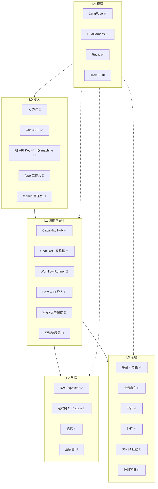

# 01 — 全面系统架构（已落地 + 目标走向）

> 更新：2026-08-05。  
> 用途：白板默画中台全景；分清 **现状 ✅** 与 **目标（试点签核）**。  
> 权威：[`AI_MIDDLE_PLATFORM.md`](../docs/strategy/AI_MIDDLE_PLATFORM.md) · [`ROADMAP.md`](../docs/ROADMAP.md) · [pilot-b §9–§12](../docs/superpowers/specs/2026-08-05-enterprise-pilot-b-gaps-design.md)。  
> 运行时分流细讲 → [02](02-runtime-split.md)；组织安全 → [03](03-org-security.md)。

---

## 一句话

**NexusAI = 企业 AI 中台的治理入口**：人/机分轨接入 → Chat∥Workflow 分流执行 → 数据连接 → 治理兜底。  
编排体验是壳，**治理 + OrgScope + 安全红线是芯**；不另造第二个 Dify 引擎。

---

## 状态图例

| 标记 | 含义 |
|------|------|
| ✅ | 代码已落地 |
| 🎯 | 目标已签核（pilot-b），实现中/未落地 |
| ① | 阶段一修洞（Task 39 等） |

---

## 五层全景（对齐新走向）



### 分层速查

| 层 | ✅ 已有 | 🎯 目标重点 |
|----|---------|-------------|
| L0 | Chat、API Key、密码换 key（现状） | JWT 人侧；三壳 UX；机 Key 仅 machine |
| L1 | Hub、Chat 双路径 DAG、链雏形 | **Runner**；Coze 导入；表单编排；只读预览 |
| L2 | RAG、租户、记忆 | **OrgScope**；连接器 + 行级 |
| L3 | 四角色、审计、护栏、审批雏形 | 业务角色；S1–S4；挂起 resume |
| L4 | LangFuse、Harness、Redis | Task 39；run_id 贯穿 |

---

## 多入口 → 执行面（目标）

见 [02-runtime-split.md](02-runtime-split.md)。摘要：

- 人：Chat（模糊）∥ 工作台运行（确定）  
- 机：只跑 Runner  
- IR 来源：自研 / Coze / 后期画布 → **同一 Runner**

---

## Chat 管线（现状代码 · 仅人侧模糊）

```text
auth → memory → rate → cache → guard → analyze → context → model_router
  ├ short: skill
  └ long: LLMHarness → …
```

细节 → [05b](05b-pipeline-nodes.md)。演进：Task 39；**不要**把机器执行画进这张图。

---

## 样板链 + 组织

```text
拉数 → RAG 制度 → LLM 计算 → 人工审批（业务角色）→ 报告
```

审批挂起须过 [03](03-org-security.md) S*；页面在 [08](08-ux-shells.md)。

---

## 角色（现状 vs 目标）

| | 现状 | 目标 |
|--|------|------|
| 平台角色 | 四角色 ✅ | 仍保留，管壳 |
| 业务角色 | 无 | `dept_manager` 等，管审批/范围 |
| 部门 | 无 | 树 + 兼岗 + OrgScope |

---

## 原则

- 质量与安全 **优先于** 工期  
- 不做第二个执行引擎；不做无权限自由画布；不用假数据撑 Demo  
- 红线不过 → 不上挂起等批  

---

## 面试六个可讲点

1. 双路径成本（Chat 内 short/long）  
2. **人/机 + Chat/Runner 分流**  
3. 平台角色 ∥ 业务角色 + OrgScope  
4. 与 Dify/Coze：应用可外编，执行与数据过治理  
5. 国企：私有化、审计、S 红线、auditor  
6. 中台：加 AI 治理层，不重造业务/数据中台  

---

## 关联

- [00](00-interview-map.md) · [02](02-runtime-split.md) · [03](03-org-security.md) · [06](06-workflow-runner.md) · [08](08-ux-shells.md)  
- pilot-b 全文 · ROADMAP · AI_MIDDLE_PLATFORM
