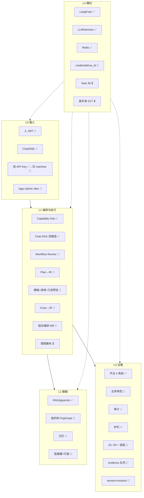

# 01 — 全面系统架构（已落地 + 目标走向）

> 更新：2026-08-08。
> 用途：白板默画中台全景；分清 **现状 ✅**、**链 A 实现中 🚧**、**签核后置 🎯**、**更远 ⏳**。
> 权威：[`AI_MIDDLE_PLATFORM.md`](../docs/strategy/AI_MIDDLE_PLATFORM.md) · [`ROADMAP.md`](../docs/ROADMAP.md) · [pilot-b §9–§12](../docs/superpowers/specs/2026-08-05-enterprise-pilot-b-gaps-design.md) · [master plan](../docs/superpowers/plans/2026-08-05-pilot-b-master-plan.md) · [Task 40](../tasks/40-pilot-b-chain-a.md)。
> 运行时分流细讲 → [02](02-runtime-split.md)；组织安全 → [03](03-org-security.md)。

---

## 一句话

**NexusAI = 企业 AI 中台的治理入口**：人/机分轨接入 → Chat∥Workflow 分流执行 → 数据连接 → 治理兜底。
编排体验是壳，**治理 + OrgScope + 安全红线是芯**；不另造第二个 Dify 引擎。

---

## 状态图例

| 标记 | 含义                                        |
| ---- | ------------------------------------------- |
| ✅   | 代码已落地（V0.0.1 基线）                   |
| 🚧   | 设计已锁，链 A / Task 40 实现中或未齐       |
| 🎯   | 已签核；排在 7A 后、可交错不挡 7A，或属链 B |
| ⏳   | ROADMAP 更远 / 不阻塞试点金线               |

---

## 五层全景（对齐试点走向）



### 分层速查

| 层  | ✅ 已有                  | 🚧 链 A                                 | 🎯 后置 / ⏳ 更远                 |
| --- | ------------------------ | --------------------------------------- | --------------------------------- |
| L0  | Chat、API Key（全通路）  | JWT；`/app` `/admin` `/dev`             | 机 Key 仅 machine（链 B）         |
| L1  | Hub、Chat 双路径 DAG     | Runner；Plan→IR；模板+表单；只读预览    | Coze（不挡 7A）；组合 W8；画布 ⏳ |
| L2  | RAG、租户、记忆          | OrgScope（含 RAG 过滤）                 | 连接器深化 + 行级                 |
| L3  | 四角色、审计、护栏       | 业务角色；S\*+挂起；evidence；lifecycle | —                                 |
| L4  | LangFuse、Harness、Redis | credential_kind / run_id 贯穿           | Task 39；规模化 D17               |

### 模块说明（功能 · 逻辑 · 设计思想）

#### L0 接入

- **Chat/SSE ✅** — 人侧模糊入口：自然语言进 LangGraph 管线，流式回写。设计上只服务「说不清要什么」；确定动作不应挤进这条贵路径。
- **API Key ✅→机-only 🎯** — 现状 `X-API-Key` 打通全站；目标收紧为机器凭证，禁止浏览器当会话用。逻辑是人机分轨，审计能区分谁在代表谁跑。
- **JWT 人侧 🚧** — 登录发短会话，工作台/Chat 共用 `verify_session`。思想：人凭证可吊销、可挂 OrgScope；与长期 `cg_` 解绑。
- **三壳 `/app` `/admin` `/dev` 🚧** — 同仓三套 IA：业务跑流、管理组织/审批、QA 负向。设计是产品壳不掺四槽 Key，开发壳可后置并行。

#### L1 编排与执行

- **Capability Hub ✅** — 能力注册表 + 统一 `invoke` + 动态权限串。思想：编排节点只指向已登记能力，执行与权限同一闸门，避免旁路调模型。
- **Chat DAG 双路径 ✅** — `model_router` 分 short（skill）/ long（LLM）。逻辑是能确定性回答就别烧 token；机器执行不要画进这张图。
- **Workflow Runner 🚧** — 确定动作唯一执行面：IR 快照、写节点幂等、节点二次鉴权 fail-closed。思想：换编排壳不换引擎。
- **Plan→IR 🚧** — 复杂目标在 Runner 侧生成可见-only 草稿 IR，人确认再跑；Chat 只 handoff。设计拒绝把 planner/tool-loop 塞进 Chat DAG（D12）。
- **模板+表单 · 只读预览 🚧** — 选模板、填参、排序、保存；流程图只读展示。思想：先让业务「能配能跑」，不做无治理自由画布。
- **Coze→IR 🎯** — 外编导入同一 IR/Runner；整单拒绝不合格包。排在链 A 可交错，但不挡 7A 金线。
- **组合编排 W8 🎯** — 多 workflow 子 run、agent 同 run 内 Hub 链、环检测与深度上限。7A 后人侧核心；子不占用户并发配额（D14/15）。
- **受限画布 ⏳** — 仅拖已授权节点的后期体验层；仍挂 Runner，不是第二引擎。

#### L2 数据

- **RAG / pgvector ✅** — 租户知识库检索与缓存，供 Chat 或 Runner 节点消费。设计是知识进治理域，不另开无租户隔离的向量旁路。
- **记忆 ✅** — hot/warm/cold 分层存取，服务对话连续性。部门维过滤在试点标 N/A，避免假完整。
- **OrgScope 🚧** — 组织树 + 兼岗求值；RAG 写打标、读过滤。思想：数据可见范围跟 acting_user 走，不是只靠租户 ID。
- **连接器 + 行级 🎯** — OA/财务等出站用 machine key，行级跟用户。样板起步服务对账链；深对接后置，密钥不进浏览器。

#### L3 治理

- **平台 4 角色 ✅** — super_admin / auditor / tenant_admin / user，管壳与跨租户审计。与业务审批角色正交，不混成一张角色表。
- **业务角色 🚧** — 首批 `member` / `dept_manager`，管审批与范围。逻辑：平台角色管「进哪个壳」，业务角色管「批哪条流」。
- **审计 ✅** — 关键请求落审计；目标补齐 acting_user / credential_kind / run_id。思想：事后可追责优于事前堆字段。
- **护栏 ✅** — 输入注入拦截、PII 脱敏等，挂在 Chat 与后续 Runner 共用安全面。质量与安全优先于工期。
- **S1–S4 + 挂起 🚧** — 红线可测后才允许缺权挂起；approve=短命 delegation（D10/11）。不过红线不上挂起，防「假审批」演示。
- **evidence 队列 🚧** — 节点产出证据；工作台「AI 已审」可点开引用。学 AtlasClaw 体验，不改 Chat/Runner 分界（D13）。
- **version + revision 🚧** — 人显式 `V*` 与每次发布 `revision` 分离；审计两者都写。回滚只加 revision，避免与平台 semver 混用（D16）。

#### L4 横切

- **LangFuse ✅** — 链路与成本可观测；随 SDK/服务升级保持主路径埋点。设计是治理叙事的「看得见」，不是另造监控产品。
- **LLMHarness ✅** — Chat/Hub 主路径统一出口：预算闸、cost 记账、failover、观测。旁路见文末「LLM 出口两层」。
- **Redis ✅** — 缓存/限流等共享能力，静默降级。多 worker 后进程内桶失效，规模化项再迁（见 D17）。
- **credential / run_id 🚧** — 契约预留人机凭证种类与一次运行 ID，贯穿鉴权、审计、观测。实现分阶段回填，避免一步关窗。
- **Task 39 ⏳** — Chat 早预处理（归一化、cheap gate、缓存 hash 对齐）。修洞重要，但明确不阻塞 7A。
- **高并发 D17 ⏳** — 限流迁 Redis、LLM 信号量、workflow 队列化等。同步 API 不排队；队列长在异步层。

---

## 实现路径（链 A → 组合 → 链 B）

```text
W0 契约列 → W1 OrgScope → W2A JWT → W3 Runner → W3b Plan→IR
  → W4 挂起(S*) → W5a/5b 壳(+证据) → 7A ★
  → W8 组合编排 → 2B/7B 机侧收紧
W6 Coze ∥；Task 39 ∥（皆不挡 7A）
```

当前版本线：V0.0.1 = 基线已落地；V0.1.0 = 链 A 人侧金线 + 工作台 UX（推进中）。

---

## 多入口 → 执行面（目标）

见 [02-runtime-split.md](02-runtime-split.md)。摘要：

- 人：Chat（模糊）∥ 工作台运行（确定）
- 机：只跑 Runner
- IR 来源：自研 / Coze / 后期画布 → **同一 Runner**；Plan 草稿也落 IR，不进 Chat DAG

---

## Chat 管线（现状代码 · 仅人侧模糊）

```text
auth → memory → rate → cache → guard → analyze → context → model_router
  ├ short: skill
  └ long: LLMHarness → …
```

细节 → [05b](05b-pipeline-nodes.md)。演进：Task 39；**不要**把机器执行画进这张图。

---

## 样板链 + 组织

```text
拉数 → RAG 制度 → LLM 计算 → 人工审批（业务角色）→ 报告
```

审批挂起须过 [03](03-org-security.md) S\*；页面在 [08](08-ux-shells.md)；证据与队列叙事见 D13。

---

## 角色（现状 vs 目标）

|          | 现状      | 目标                                      |
| -------- | --------- | ----------------------------------------- |
| 平台角色 | 四角色 ✅ | 仍保留，管壳                              |
| 业务角色 | 无        | `member` / `dept_manager` 等，管审批/范围 |
| 部门     | 无        | 树 + 兼岗 + OrgScope                      |

---

## 原则

- 质量与安全 **优先于** 工期
- 不做第二个执行引擎；不做无权限自由画布；不用假数据撑 Demo
- 红线不过 → 不上挂起等批
- 先链 A（人）后链 B（机）；组合编排在 7A 与 2B 之间

---

## 面试六个可讲点

1. 双路径成本（Chat 内 short/long）
2. **人/机 + Chat/Runner 分流**；复杂任务 Plan→IR，Chat 只 handoff
3. 平台角色 ∥ 业务角色 + OrgScope；挂起=delegation
4. 与 Dify/Coze：应用可外编，执行与数据过治理；组合仍唯一 Runner
5. 国企：私有化、审计、S 红线、auditor、evidence 可追
6. 中台：加 AI 治理层，不重造业务/数据中台

---

## LLM 出口两层（别混）

| 对比项 | 旁路客户端 `llm_client.py` | 主路径 `LLMHarness`（`harness/llm.py`） |
|--------|---------------------------|----------------------------------------|
| API | `get_llm_client` / `complete_via_provider` | `generate` / `stream` |
| 职责 | provider 模式、消息归一、key failover | 预算闸、cost 记账、LangFuse usage，再调底层 |
| 谁用 | RAG、Agent、Eval | Chat `llm_generate`、Capability `kind=model`、SSE |
| `check_budget` | 无 | 调用前有 |
| `record_consumption` | 无 | 成功后有 |
| 注入 / PII | 无（也不该在这层） | 无 → 在 `guardrails_*` / Hub governance |

旁路未收口满 Harness = 诚实债；主路径禁裸 SDK。细节 → [07c](07c-harness-cost-shortpath.md)。

---

## 关联

- [00](00-interview-map.md) · [02](02-runtime-split.md) · [03](03-org-security.md) · [06](06-workflow-runner.md) · [07c](07c-harness-cost-shortpath.md) · [08](08-ux-shells.md)
- pilot-b · master plan · Task 40 · ROADMAP · AI_MIDDLE_PLATFORM
