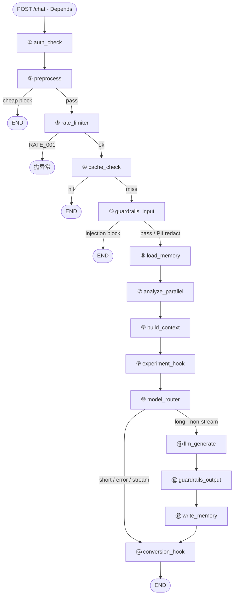

# 05b — 深挖 B：Chat Pipeline 全节点与条件边

> 更新：2026-08-08。  
> 面试目标：白板默画 **Chat DAG**、说清条件边与早退成本；分清 **现状 ✅** / **管线债 🚧** / **不进本图的目标 🎯**。  
> **范围：** 仅 **人侧模糊需求** 的 `/chat` 管线。机器执行、工作台「运行」、挂起审批、Plan→IR **不要**画进本图。  
> 锚点：`backend/pipeline/graph.py` · `router.py` · `state.py` · `nodes/*`  
> 分流 → [02](02-runtime-split.md)；短路径/Harness → [07c](07c-harness-cost-shortpath.md)；早预处理 → [`tasks/39`](../tasks/39-pipeline-early-preprocess.md)（**不阻塞 7A**，master D6）。

| 标记 | 含义 |
|------|------|
| ✅ | 节点/能力已有实现（位置可能已按规划重排） |
| 🚧 | Task 39 规划已定、代码未齐（总图按规划画） |
| 🎯 | 试点目标在 Runner/壳，**不进本 Chat DAG** |

> **总图 = Task 39 规划主链**（[`tasks/39`](../tasks/39-pipeline-early-preprocess.md)）。  
> **代码现状一句：** 仍是 `auth → load_memory → rate → cache → …`，且无 `preprocess`；落地前面试以本图为「要做成什么样」，并主动说未合入。

---

## 0. 总图（规划 🚧 · Chat only）

画法：**主链一条直线**（默认走到底）+ **早退表**（从哪一步拐走）+ **mermaid**（条件边）。避免嵌套树导致「箭头对不上」。

### 0.1 图外入口

| 步骤 | 做什么 |
|------|--------|
| `POST /chat` + Depends | 现状 Key → `TenantContext`；目标人侧 JWT 🎯；机不进 Chat |
| `_run_chat_pipeline` | 组 state → `ainvoke` → 成功 `log_audit` / 异常上抛 / finally flush\|discard |

### 0.2 主链（默认路径 · 从左到右读）

```text
①auth_check → ②preprocess → ③rate_limiter → ④cache_check
    → ⑤guardrails_input → ⑥load_memory → ⑦analyze_parallel
    → ⑧build_context → ⑨experiment_hook → ⑩model_router
    → ⑪llm_generate → ⑫guardrails_output → ⑬write_memory
    → ⑭conversion_hook → END
```

| # | 节点 | 功能（一句话） |
|---|------|----------------|
| ① | `auth_check` ✅ | 补齐 `user_context`（非验 key） |
| ② | `preprocess` 🚧 | normalize → `query_hash`；cheap gate（空/超长/deny-list）；保留 raw 供审计 |
| ③ | `rate_limiter` ✅ | 租户限流；超限 `raise RATE_001`（硬中断，不走 END 边） |
| ④ | `cache_check` ✅ | 用 `query_hash` 查 exact/template；命中填 response |
| ⑤ | `guardrails_input` ✅ | 注入拦截 / PII 脱敏（详见下节） |
| ⑥ | `load_memory` ✅ | 读 hot/warm/cold；**仅主链走到此处才执行** |
| ⑦ | `analyze_parallel` ✅·名实🚧 | 意图 + confidence + fingerprint；entities 仍空 |
| ⑧ | `build_context` ✅ | 记忆拼进 `raw_input` |
| ⑨ | `experiment_hook` ✅ | A/B 分流、曝光；可改 model/prompt |
| ⑩ | `model_router` ✅ | short skill 或长路径选模/估价/灌 key |
| ⑪ | `llm_generate` ✅ | `LLMHarness.generate`（SSE 常走 router 旁路） |
| ⑫ | `guardrails_output` ✅ | 出站检查；仅长路径 |
| ⑬ | `write_memory` ✅ | `write_turn` + 同 `query_hash` 写缓存 |
| ⑭ | `conversion_hook` ✅ | 记 A/B conversion |

### 0.3 早退 / 分叉（从主链哪一站离开）

| 离开点 | 条件 | 去向 | 还读 memory？ | 还经 conversion？ |
|--------|------|------|---------------|-------------------|
| ② preprocess | cheap **block** | END | 否 | 否 |
| ③ rate_limiter | 超限 | **抛异常**（非 END 边） | 否 | 否 |
| ④ cache_check | **hit** | END | 否 | 否 |
| ⑤ guardrails_input | 注入 **block** | END | 否 | 否 |
| ⑤ guardrails_input | PII **redact** | **留在主链** → ⑥ | 是（继续） | 视后续 |
| ⑩ model_router | short / error / stream | → ⑭ conversion → END | 已读过 | 是 |
| ⑩ model_router | `routed_to_llm` ∧ ¬stream | → ⑪…⑭ 主链 | 已读过 | 是 |

**口诀：** 没过「miss + 注入 pass」之前，**绝不** `load_memory`。

### 0.4 条件边（mermaid）



**引擎：** 优先官方 LangGraph；否则 `langgraph_compat` shim。  
**代码现状一句：** 仍是 `auth → load_memory → rate → cache → …`，无 `preprocess`；白板先画上图。

### `guardrails_input` 含什么（`check_input`）

顺序固定，**先注入再 PII**（长度以规划为准见下）：

| 步骤 | 行为 | 结果 |
|------|------|------|
| ① Prompt 注入 | 正则匹配 `INJECTION_PATTERNS`（忽略系统提示/扮演/system: 等） | **`blocked`** → `GUARD_001`，条件边 END |
| ② PII 脱敏 | `PII_PATTERNS`：身份证 → 银行卡 → 手机 → 邮箱 → IP（先长后短） | **`redacted`** → 改写 `message` 为 `[REDACTED:…]`，**继续**；**不改** `query_hash` |
| ③ 超长 | 现状代码：`>10000` truncate redact；**规划 🚧**：改由 `preprocess` **硬拦**（GATE_002），本节点去掉双重语义 | 规划落地后此处不再靠截断续跑 |
| ④ 通过 | 以上皆无 | **`pass`** → 才进入 `load_memory` |

**不含：** 出站护栏（`guardrails_output`）；租户规则配置台；语义注入模型；normalize / deny-list / 空串（在 **`preprocess`**）。

**条件边：** 仅 injection **block** → END；PII redact **不**早退。

### 0b. 边界：本图不承担什么（🎯）

| 能力 | 落点 | 勿讲成 |
|------|------|--------|
| 确定动作 / 请假审批 / 挂起 | [06](06-workflow-runner.md) · [HITL](../docs/superpowers/designs/2026-08-08-human-gate-hitl.md) | Chat 节点里加 approve |
| 复杂任务分解 Plan→IR（D12） | Wave 3b；Chat 最多 **handoff 卡** | 在 DAG 里做 planner/tool-loop |
| 多模型编排 / 画布试跑 | Runner + Hub model 能力 | 扩成第二套执行引擎 |
| chat → capability 链桥接 | ROADMAP 阶段二 | 已与 Hub 打通（现状两路仍断开） |

**过渡债：** Runner/3b 前，Chat 里复杂问 ≈ 单次 LLM，无工具保证——面试主动承认。

---

## 1) 入口层（图外，必须会讲）

| 层 | 现状 ✅ | 目标 🎯 | 不做什么 |
|----|---------|---------|----------|
| 认证 Depends | `verify_api_key` → `TenantContext` | 人侧 `verify_session`（JWT）；机不进 `/chat` | 不在图节点里再验 key |
| `require_permission("chat:write")` | RBAC / 应用权限 | 不变思路 | — |
| `chat_pipeline` / `_run_chat_pipeline` | 组 state、`ainvoke`、审计、采样 flush | — | 不把业务逻辑堆在路由里 |
| `auth_check` 节点 | 补齐 `user_context` 默认值 | — | **不是**第二道认证 |

**面试陷阱：** 「管线第一个节点做认证」——错。认证在 FastAPI；节点是注入/兜底。

---

## 2) 逐节点速查（面试卡片）

### ① `auth_check`
- **输入/输出：** 补齐 `user_context`
- **不做：** 查库验 key
- **失败模式：** 几乎不失败

### ② `preprocess` 🚧（规划新增）
- **做：** normalize + cheap gate + 写 `query_hash`；见总图
- **代码：** 尚未合入；现状无此节点

### ③ `rate_limiter`
- **做：** `check_rate_limit(tenant_id)`；失败写 `RATE_001` 后 **`raise NexusAIException`**
- **规划位置：** `preprocess` 之后、`cache_check` 之前
- **面试：** 限流是「硬中断」，不是 `finish_reason` 软结束

### ④ `cache_check`
- **做：** exact / 可选 template；命中填 response 后 END
- **规划：** 只用 `state["query_hash"]`；hit **不**读 memory
- **代码现状：** 仍可能裸 hash——落地时与 write 对齐

### ⑤ `guardrails_input`
- **做：** 见 §0「含什么」——注入 block / PII redact
- **条件边：** **仅 block** → END；redact 继续 → **`load_memory`**
- **trade-off：** 在 cache **之后**——假设缓存只存干净答案

### ⑤b `load_memory`（规划位置）
- **做：** `UnifiedMemoryService.read` → `hot/warm/cold` 进 state
- **位置（定案）：** miss + guard **pass** 之后、`analyze_parallel` 之前
- **代码现状：** 仍在 `auth_check` 后过早执行——总图已按规划画
- **诚实：** `session_id=None` 传给 read 时开口前再扫 `memory_service.read`

### ⑥ `analyze_parallel`
- **名实：** `asyncio.gather` 里目前主要是意图一项；`entities` 在 `_analyze_intent` 里 **恒 `{}`**
- **做：** 调 intent 模块同源分类器；写 `intent` / `intent_confidence` / `fingerprint`
- **降级：** 异常 → `default` + confidence 0.5（偏保守进长路径/best 档逻辑）

### ⑦ `build_context`
- **做：** 用已载入记忆 `assemble_prompt_block`；记忆漂移则只留隔离头；拼进 **`raw_input`**
- **关键：** `llm_generate` 读的是 `raw_input`（不是裸 `message`）→ 记忆**会**进模型（经 raw_input 重写）
- **注意：** 初始 state 里 `raw_input==message`；本节点之后才是「记忆+用户」

### ⑧ `experiment_hook`
- **做：** 确定性分流、写 `ab_*`、记曝光；variant 可改 model / system_prompt 等
- **位置：** 在 router 前，故能影响选模与生成

### ⑨ `model_router` → 详见 [07c](07c-harness-cost-shortpath.md)
- short：skill，`total_cost=0`
- long：选模、估价、灌 key，`finish_reason=routed_to_llm`
- **条件边：** 仅 `routed_to_llm` 且非 `stream_mode` → `llm_generate`；否则 `conversion_hook`

### ⑩ `llm_generate`
- **做：** `LLMHarness.generate`；失败 fallback / `COST_001`
- **流式：** 图边常不进本节点；SSE 在 `router.chat_streaming` 另走 Harness.stream

### ⑪ `guardrails_output`
- **做：** 输出侧检查/脱敏；长路径专属（short 不经此节点）

### ⑫ `write_memory`
- **做：** `write_turn` + 可选 cold 摘要；mock 等条件下写 exact/template cache；插 `audit_logs`（节点内也有审计 SQL——与 router `log_audit` 分工要诚实：可能双通道，开口说「router 收尾 audit + 节点写库」时以代码为准核对）
- **仅长路径到达**（short 从 model_router 直去 conversion）

### ⑬ `conversion_hook`
- **做：** 有实验且有最终响应时记 conversion；DB 挂了不拖垮管线
- **不到达：** cache hit / input block 直接 END 时**不经过**本节点

---

## 3) 条件边（规划 · 背熟）

| 边 | 函数 | end / continue |
|----|------|----------------|
| gate（规划） | cheap block → END | pass → rate_limiter |
| cache | `should_skip_to_end` | hit→END；miss→guardrails |
| guard | `should_block_to_end` | block→END；**pass→load_memory**（再 analyze） |
| router | `route_short_or_long` | 仅 `routed_to_llm`∧¬stream → llm_generate；其余 conversion |

**设计原则口述：**  
早退越靠前越省钱；**记忆只为真正要生成的请求服务**；花钱节点（LLM）前完成配额、缓存、安全；短路径错误不得漏进 LLM。

---

## 4) 路径 × 成本 × 是否读记忆（按规划总图）

| 路径 | 典型 `finish_reason` | 调 LLM？ | load_memory？ | write_memory？ | conversion_hook？ |
|------|----------------------|----------|---------------|----------------|-------------------|
| cheap gate | `blocked` + GATE_00x | 否 | **否** | 否 | 否 |
| cache hit | `cache_hit` | 否 | **否** | 否 | 否 |
| rate limit | `RATE_001` 异常 | 否 | **否**（在 memory 前） | 否 | 否 |
| input block | `blocked` + GUARD_001 | 否 | **否** | 否 | 否 |
| short skill | `skill_executed` / error | 否 | **是** | 否 | 是 |
| long OK | `llm_generated` | 是 | **是** | 是 | 是 |
| budget | `COST_001` | 拒在 Harness | 是 | 是* | 是 |

\*长路径失败仍可能经过 write/guard 后续边——以实现为准。  
**代码未合入前：** 现状仍是几乎所有路径都先 `load_memory`——面试先画规划图，再补一句债。

---

## 5) 状态与可观测

### `PipelineState`（TypedDict，非 Pydantic）
身份 / message·raw_input / 三层记忆 / intent·fingerprint·cache / 护栏标志 / 选模与 key / response·finish_reason / 成本延迟 / A/B / stream_mode …

### LangFuse 嵌套（GAP-08）
`_lf_node` 把根 trace/span id 经 state 传入每个节点，避免 LangGraph 丢 contextvar 导致平铺根 span。

### 采样
短路径可 `set_tracing_enabled(False)`；router `finally` 里 `flush` vs `discard`。

---

## 6) 三维速记

### 图怎么说
- `pipeline` 包 fan-out 到 `core`；入口 `build_pipeline` / `_run_chat_pipeline`
- 热点边在 `routers→core`，但 **业务故事在 DAG 条件边**

### 面试官爱问

1. 为何 cache 在护栏前？→ 性能；前提是写路径干净
2. load_memory 在哪？→ **规划：** miss+guard pass 后；代码仍偏早——总图按规划
3. auth_check 验什么？→ 几乎不验，Depends 已验；目标人侧 JWT 仍在图外
4. analyze 并行了什么？→ 目前意图为主，实体空
5. short 失败会进 LLM 吗？→ 不会，反向条件边
6. 记忆怎么进模型？→ `build_context` 写入 `raw_input`，`llm_generate` 读它
7. hit 为何不记 conversion？→ 边直接 END；A/B 转化只覆盖走到 hook 的路径
8. 请假/多步编排画在 Chat 吗？→ 否；Runner + 挂起；Chat 最多 handoff（D12）

### 求职者 60 秒口述

> Chat 只服务人侧模糊对话。规划主链：预处理（normalize + cheap gate）→ 限流 → 缓存；命中或拦截都不读记忆。
> miss 后过注入/PII 护栏，**再** load_memory → 意图 → 拼 raw_input → A/B → short skill 或 Harness。
> 代码尚未重排（Task 39，不挡 7A）；确定动作与审批不进这张图。

---

## 7) 落地债（总图已是规划态）

> Task 39：**设计已拍板，待实现**；**不阻塞 7A**（D6）。主链见 **§0**，此处只列与代码的差。

| 优先级 | 点 | 代码现状 | 规划（§0） |
|--------|----|----------|------------|
| P0 | preprocess | 无 | normalize + cheap gate + query_hash |
| P0 | load_memory 位置 | auth 后立刻 | miss + guard pass 后 |
| P0 | cache key | 裸 hash | 统一 query_hash |
| P1 | analyze 名实 | entities 空 | 真并行或改名 |
| P1 | rate / finish_reason | 抛异常 | 审计字段更一致 |
| P2 | stream / 双审计通道 | 旁路与双写 | 文档化或收口 |
| 🎯 | chat↔Hub | 两路断开 | 阶段二桥接（非 Runner） |

与 07c / 02 / 06：**少送无效请求进 Harness；确定多步在 Runner——Chat 不胀成第二引擎。**

---

## 8) 自测（10 分钟）

不看笔记默写：

1. §0 规划顺序（含 preprocess；load_memory 在 miss+guard 后）
2. 哪些路径 **不** `load_memory` / 不经 `conversion_hook`
3. `raw_input` 在哪一步变成「记忆+用户」
4. `auth_check` vs Depends；目标人为何是 JWT
5. 代码与规划差在哪；为何 Task 39 不挡 7A

```bash
sed -n '63,122p' backend/pipeline/graph.py
sed -n '100,108p' backend/pipeline/nodes/model_router.py
sed -n '15,45p' backend/pipeline/nodes/build_context.py
```

---

## 9) 衔接

- 深挖 C（钱与 Harness）→ [07c](07c-harness-cost-shortpath.md)
- 人/机分流 · Plan→IR → [02](02-runtime-split.md)
- Runner / 挂起 → [06](06-workflow-runner.md)
- Task 39 → [`tasks/39-pipeline-early-preprocess.md`](../tasks/39-pipeline-early-preprocess.md)
- 下一深挖：**A Auth** [04a](04a-auth-rbac.md) 或 **D RAG + Capability** [09d](09d-rag-capability.md)
