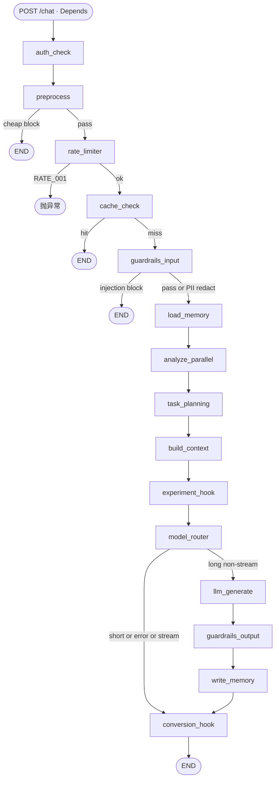

# 05b — 深挖 B：Chat Pipeline 全节点与条件边

> 更新：2026-08-14（Task 39 已落地）。  
> 面试目标：白板默画 **Chat DAG**、说清条件边与早退成本；分清 **现状 ✅** / **管线债 🚧** / **不进本图的目标 🎯**。  
> **范围：** 仅 **人侧模糊需求** 的 `/chat` 管线。机器执行、工作台「运行」、挂起审批、Plan→IR **不要**画进本图。  
> 锚点：`backend/pipeline/graph.py` · `router.py` · `state.py` · `nodes/*`  
> 分流 → [02](02-runtime-split.md)；短路径/Harness → [07c](07c-harness-cost-shortpath.md)；早预处理 → [`tasks/39`](../tasks/39-pipeline-early-preprocess.md)。

| 标记 | 含义 |
|------|------|
| ✅ | 节点/能力已有实现 |
| 🚧 | 规划已定、代码未齐 |
| 🎯 | 试点目标在 Runner/壳，**不进本 Chat DAG** |

> **总图 = 当前代码主链**（与 [`tasks/39`](../tasks/39-pipeline-early-preprocess.md) 一致）。

---

## 0. 总图（Chat only）

画法：**主链一条直线**（默认走到底）+ **早退表**（从哪一步拐走）+ **mermaid**（条件边）。

### 0.1 图外入口

| 步骤 | 做什么 |
|------|--------|
| `POST /chat` + Depends | 现状 Key → `TenantContext`；目标人侧 JWT 🎯；机不进 Chat |
| `_run_chat_pipeline` | 组 state → `ainvoke` → 成功 `log_audit`（`input_text`=raw）/ 异常上抛 / finally flush\|discard |

### 0.2 主链（默认路径 · 从左到右读）

```text
①auth_check → ②preprocess → ③rate_limiter → ④cache_check
    → ⑤guardrails_input → ⑥load_memory → ⑦analyze_parallel
    → ⑦b task_planning → ⑧build_context → ⑨experiment_hook → ⑩model_router
    → ⑪llm_generate → ⑫guardrails_output → ⑬write_memory
    → ⑭conversion_hook → END
```

| # | 节点 | 功能（一句话） |
|---|------|----------------|
| ① | `auth_check` ✅ | 补齐 `user_context`（非验 key） |
| ② | `preprocess` ✅ | NFKC normalize → `query_hash`；`message`=normalized；cheap gate；`raw_input` 保原话 |
| ③ | `rate_limiter` ✅ | 租户限流；超限 `raise RATE_001`；GATE block 路径显式 bump |
| ④ | `cache_check` ✅ | 只用 `state.query_hash` 查 exact；缺 hash → miss+warn |
| ⑤ | `guardrails_input` ✅ | 注入拦截 / PII 脱敏；**不改** `query_hash` |
| ⑥ | `load_memory` ✅ | 读 hot/warm/cold；**仅主链走到此处才执行** |
| ⑦ | `analyze_parallel` ✅·名实🚧 | 意图 + confidence + fingerprint；entities 仍空 |
| ⑦b | `task_planning` ✅ | Task 43 咨询性 plan（state 字段仍名 `task_plan`；节点名避开 LangGraph 与 state key 冲突） |
| ⑧ | `build_context` ✅ | 记忆拼进 **`assembled_prompt`**（不覆盖 `raw_input`） |
| ⑨ | `experiment_hook` ✅ | A/B 分流；prefix 拼到 `assembled_prompt` |
| ⑩ | `model_router` ✅ | short skill 或长路径选模/估价/灌 key |
| ⑪ | `llm_generate` ✅ | 读 `assembled_prompt`（缺省回退 `message`） |
| ⑫ | `guardrails_output` ✅ | 出站检查；仅长路径 |
| ⑬ | `write_memory` ✅ | `write_turn` + 同 `query_hash` 写 exact（mock）；审计 input=raw |
| ⑭ | `conversion_hook` ✅ | A/B conversion；成功终态可补 `chat.task_plan` 审计 |

### 0.3 早退 / 分叉

| 离开点 | 条件 | 去向 | 还读 memory？ | 还经 conversion？ |
|--------|------|------|---------------|-------------------|
| ② preprocess | cheap **block**（GATE_001/002/003） | END | 否 | 否 |
| ③ rate_limiter | 超限 | **抛异常** | 否 | 否 |
| ④ cache_check | **hit** | END | 否 | 否 |
| ⑤ guardrails_input | 注入 **block**（GUARD_001） | END | 否 | 否 |
| ⑤ guardrails_input | PII **redact** | **留在主链** → ⑥ | 是 | 视后续 |
| ⑩ model_router | short / error / stream | → ⑭ conversion → END | 已读过 | 是 |
| ⑩ model_router | `routed_to_llm` ∧ ¬stream | → ⑪…⑭ 主链 | 已读过 | 是 |

**口诀：** 没过「miss + 注入 pass」之前，**绝不** `load_memory`。

### 0.4 条件边（mermaid）



**引擎：** 优先官方 LangGraph；否则 shim。节点名不得与 TypedDict state key 同名（故 `task_planning` ≠ `task_plan`）。

### `guardrails_input`（`check_input`）

| 步骤 | 行为 | 结果 |
|------|------|------|
| ① Prompt 注入 | `INJECTION_PATTERNS` | **blocked** → `GUARD_001` → END |
| ② PII 脱敏 | `PII_PATTERNS` | **redacted** → 改 `message`；**不改** `query_hash`；继续 |
| ③ 超长 | `check_input` **硬拦** `length_exceeded`（非 truncate）；chat 另有 preprocess GATE_002 早退 | **blocked** |
| ④ 通过 | — | **pass** → `load_memory` |

**不含：** normalize / deny-list / 空串（在 **`preprocess`**）。

### 0b. 边界（🎯）

| 能力 | 落点 |
|------|------|
| 确定动作 / 挂起审批 | Runner / HITL |
| Plan→IR / 能力执行 | Runner / Capability Hub |
| 租户级护栏配置台 | Task 32 冻结；deny-list 仅全局 env |

---

## 1) 节点诚实版

### ② `preprocess`（Task 39）
- `raw_input` 保原话；`message`=NFKC+lower+空白折叠；写 `query_hash`
- GATE_001 空 / GATE_002 超长（raw 长度）/ GATE_003 deny-list（扫 normalized）
- `PIPELINE_PREPROCESS_ENABLED`（默认 true；关则跳过 gate 仍 normalize）
- `PIPELINE_MAX_INPUT_CHARS`（默认 10000）、`PIPELINE_DENY_LIST`（逗号分隔，默认空）

### ④ `cache_check`
- exact：`exact:{tenant}:{user}:{query_hash}`；缺 hash → miss + warning
- PII 改写 message 不改 hash

### ⑥ `load_memory`
- 位置：miss + guard pass 之后、`analyze_parallel` 之前

### ⑦b `task_planning`
- fail-soft；结果写入 state[`task_plan`]

### ⑧ `build_context`
- 写入 **`assembled_prompt`**；禁止覆盖 `raw_input`

### ⑪ `llm_generate` / SSE
- 读 `assembled_prompt`（缺省 `message`）

### ⑬ `write_memory`
- mock exact 用 `query_hash`；节点内审计 `input_text`=raw

---

## 2) 条件边

| 边 | 函数 | 语义 |
|----|------|------|
| gate | `should_gate_block` | GATE_* → END；pass → rate |
| cache | `should_skip_to_end` | hit→END；miss→guard |
| guard | `should_block_to_end` | block→END；pass→load_memory |
| router | `route_short_or_long` | 长路径非流式 → llm_generate；其余 conversion |

---

## 3) 路径 × 是否读记忆

| 路径 | finish_reason | load_memory？ |
|------|---------------|---------------|
| cheap gate | `blocked` + GATE_00x | **否** |
| cache hit | `cache_hit` | **否** |
| rate limit | RATE_001 异常 | **否** |
| input block | `blocked` + GUARD_001 | **否** |
| short / long | skill / llm_generated | **是** |

---

## 4) 状态

`message` · `raw_input` · `query_hash` · `assembled_prompt` · `gate_reason` · 记忆 / intent / cache / 护栏 / `task_plan` …

---

## 5) 面试口述

> preprocess（normalize + cheap gate）→ 限流 → 缓存；命中或 GATE/GUARD 拦截都不读记忆。
> miss 后过注入/PII，再 load_memory → 意图 → task_planning → assembled_prompt → A/B → short 或 Harness。
> 审计记 raw；节点名 `task_planning` 避开与 state key `task_plan` 冲突。

---

## 6) 仍存债（非 Task 39）

| 优先级 | 点 |
|--------|----|
| P1 | analyze entities 空 |
| P2 | stream / 双审计通道 |
| 🎯 | chat↔Hub 桥接 |

---

## 7) 自测

```bash
sed -n '86,120p' backend/pipeline/graph.py
sed -n '1,80p' backend/pipeline/nodes/preprocess.py
sed -n '15,45p' backend/pipeline/nodes/build_context.py
```

---

## 8) 衔接

- [07c](07c-harness-cost-shortpath.md) · [02](02-runtime-split.md) · [06](06-workflow-runner.md)
- Task 39 → [`tasks/39-pipeline-early-preprocess.md`](../tasks/39-pipeline-early-preprocess.md)
